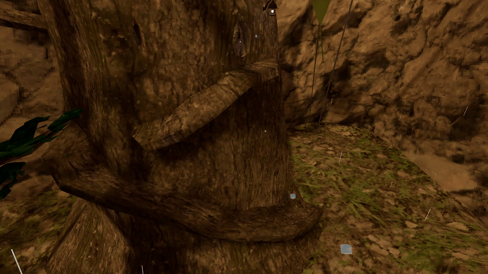

# GorillaTrials
Gorilla Tag mod that adds parkour trials with a global leaderboard. Inspired off of Orion Drift's parkour trials and GorillaKZ.

You can join the [Discord!](https://discord.gg/48fCJzPfEk)

> [!WARNING]
> If you use this mod, you agree to the [Privacy Policy](https://github.com/LapisGit/GorillaTrials/blob/main/PRIVACYPOLICY.md), as stated.

## Installation
Go to the [latest release](https://github.com/LapisGit/GorillaTrials/releases/latest), and put the .dll inside of your plugins folder.

## Authentication
Please contact Lapis if the game does not automatically create an account and set your API Key for you. (BepInEx/config/TrialsTeam.GorillaTrials.cfg under [Authorization])

## Custom Map Creation
If you are a custom map creator and wish to implement Trials into your custom map, please take a look at the [Wiki.](https://github.com/LapisGit/GorillaTrials/wiki)

## PR's
Pull requests are VERY welcome to help clean up some buggy code, or add new features, you may also make pull requests to trials.json with new trials and you'll be added to the credits below!

## Credits
Lapis: Developer

Will: Developer

developer9998: Developer

gizmogoat: Server Hoster

H4RNS: Tester

Kronicahl: Tester

# *This product is not affiliated with Another Axiom Inc. or its videogames Gorilla Tag and Orion Drift and is not endorsed or otherwise sponsored by Another Axiom. Portions of the materials contained herein are property of Another Axiom. ©2021 Another Axiom Inc.*

